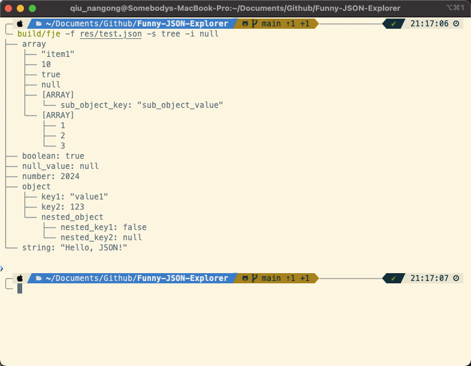
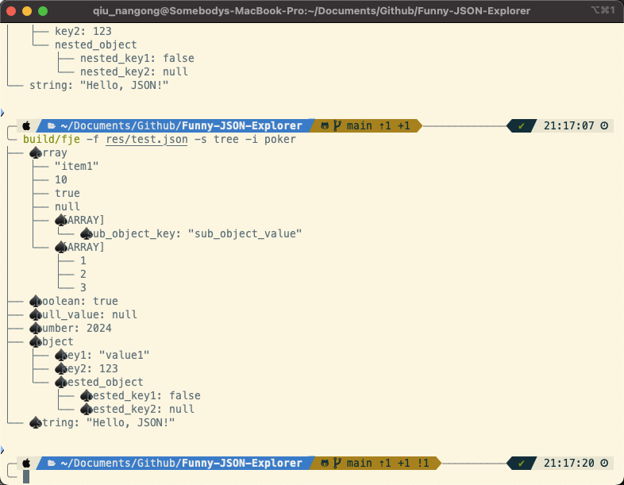
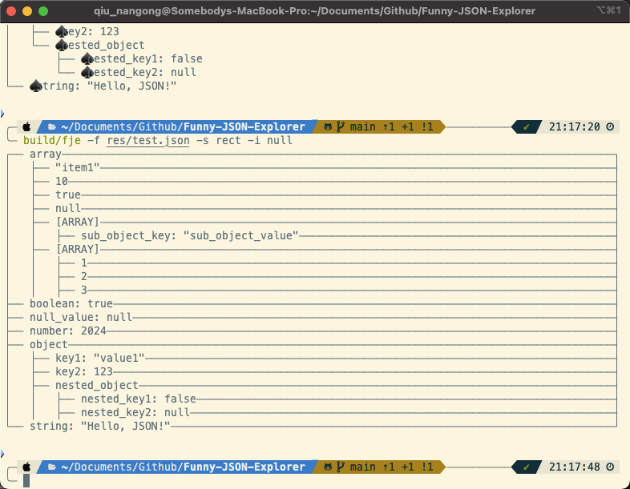
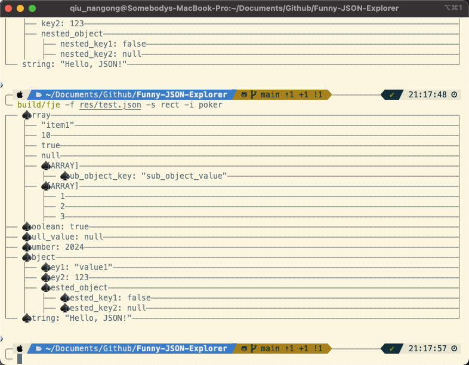

# Funny JSON Explorer

<center><div style='height:2mm;'></div><div style="font-family:华文楷体;font-size:14pt;">刘森元 21307289</div></center>
<center><span style="font-family:华文楷体;font-size:9pt;line-height:9mm">中山大学计算机学院</span>
</center>

## Overview 概述

本次作业主要用到了下列设计模式：

- Iterator & Visitor

代码结构如下

```
.
├── CMakeLists.txt
├── Doxyfile
├── README.md
├── include
│   ├── FunnyJSONExplorer.hpp
│   ├── FunnyJSONIcon.hpp
│   └── FunnyJSONStyle.hpp
├── res
│   └── test.json
└── src
    ├── FunnyJSONExplorer.cpp
    ├── FunnyJSONIcon.cpp
    ├── FunnyJSONStyle.cpp
    └── main.cpp
```

## Implement 具体实现

### Iterator 迭代器

迭代器模式用于提供一种方法顺序访问聚合对象中各个元素的方法，同时不暴露聚合对象的内部表示。在 `FunnyJSONExplorer` 中，通过使用 `nlohmann::json` 库的迭代器进行 JSON 数据的遍历，项目实质上已经实现了迭代器模式。

在 `FunnyJSONExplorer.cpp` 中的实现：

```cpp
for (auto it = cur.begin(); it != cur.end(); ++it) {
    // 处理每个 JSON 元素
}
```

这一迭代逻辑体现了迭代器模式，使得无论 JSON 数据的内部结构如何（数组、对象或嵌套的组合），遍历过程都保持一致，且代码不直接依赖于数据的内部表示。

### Visitor 访问者

访问者模式允许对一个对象结构中的元素执行操作，可以定义新的操作而无需改变所作用的元素的类。在 `FunnyJSONExplorer` 项目中，虽然没有一个显式的 "访问者" 接口或类，样式处理的实现却符合访问者模式的核心思想。

项目中定义了不同的样式类（如 `JSONStyle_Tree` 和 `JSONStyle_Rect`），这些类通过 `explore` 方法实现对 JSON 数据的不同视图展示。这些方法根据元素类型（对象、数组、基本类型）动态地选择合适的显示格式。

例如，在 `JSONStyle_Tree` 中的 `explore` 方法：

```cpp
std::string JSONStyle_Tree::explore(...) {
    // 根据 JSON 类型和深度生成树状视图
}
```

此处，`explore` 方法相当于访问者模式中的 `visit` 方法，`JSONStyle_Tree` 和 `JSONStyle_Rect` 类似于具体的访问者，它们定义了对 JSON 元素的操作。

***详细文档 & 设计类图 详见 docs/html/index.html***

## Result 运行结果









## GitHub URL

项目地址：https://github.com/Myocardial-infarction-Jerry/Funny-JSON-Explorer

