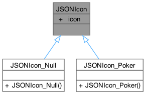
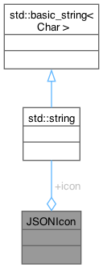
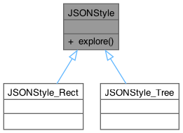
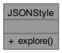
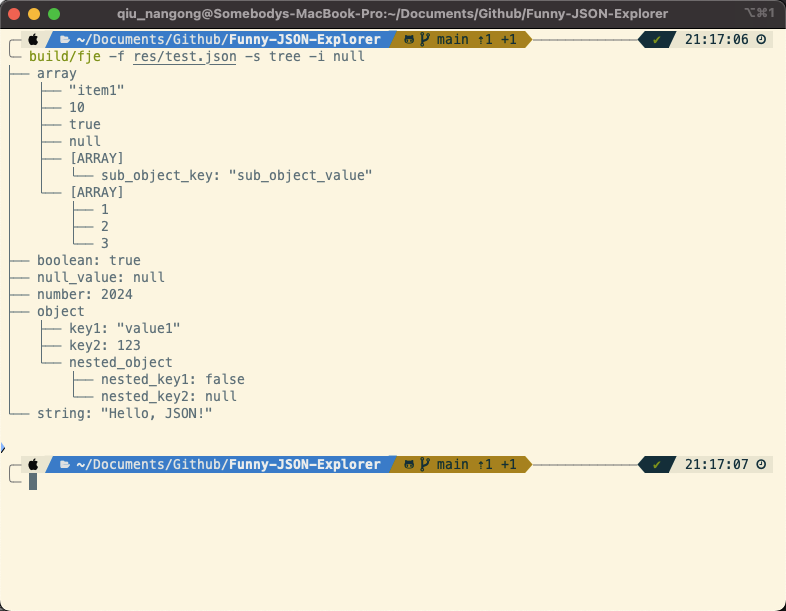
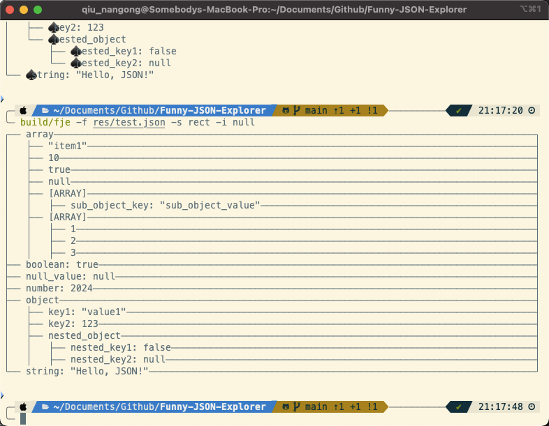
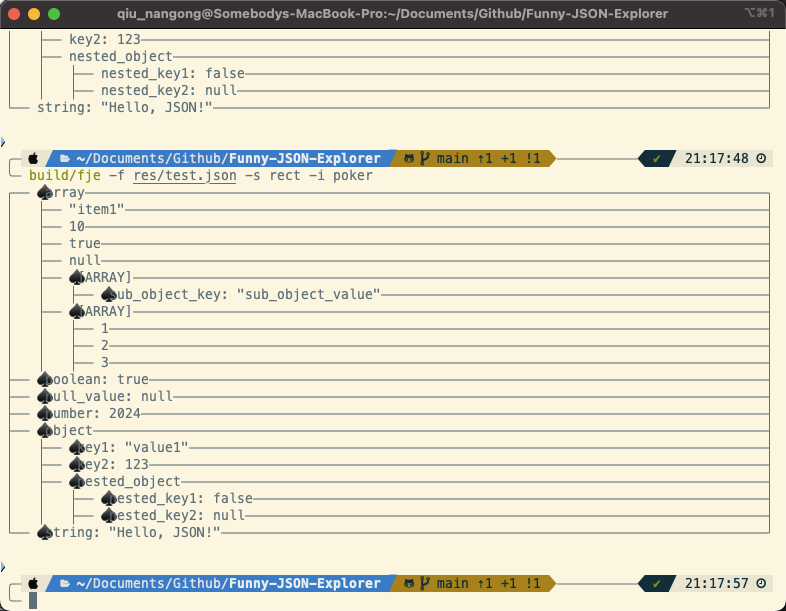

# Funny JSON Explorer

<center><div style='height:2mm;'></div><div style="font-family:华文楷体;font-size:14pt;">刘森元 21307289</div></center>
<center><span style="font-family:华文楷体;font-size:9pt;line-height:9mm">中山大学计算机学院</span>
</center>

## Overview 概述

本次作业主要用到了下列设计模式：

- 工厂方法
- 抽象工程
- 建造者
- 组合模式

代码结构如下

```
.
├── CMakeLists.txt
├── Doxyfile
├── include
│   └── FunnyJSONExplorer.hpp
├── src
│   ├── FunnyJSONExplorer.cpp
│   └── main.cpp
└── test.json
```

## Implement 具体实现

### Factory Method 工厂方法

**具体例子**：`FunnyJSONExplorer` 构造函数中的 `style` 和 `icon` 对象的创建。


```cpp
FunnyJSONExplorer::FunnyJSONExplorer(
    const nlohmann::json &data,
    const std::string &style,
    const std::string &icon
) : data(data) {
    if (style == "tree")
        this->style = new JSONStyle_Tree();
    else if (style == "rect")
        this->style = new JSONStyle_Rect();

    if (icon == "null")
        this->icon = new JSONIcon_Null();
    else if (icon == "poker")
        this->icon = new JSONIcon_Poker();
}
```

最终输出结果涉及到互不相关的属性：风格、图标族，工厂方法模式通过定义一个创建对象的接口，让子类决定实例化哪个类。这里，`FunnyJSONExplorer` 构造函数根据传入的 `style` 和 `icon` 参数来实例化不同的 `JSONStyle` 和 `JSONIcon` 子类对象。这种方式提供了灵活性，允许在运行时决定创建哪个具体类的实例。

#### JSONIcon





#### JSONStyle





### Abstract Factory 抽象工厂

**具体例子**：`FunnyJSONExplorer` 构造函数充当了一个抽象工厂，负责创建一组相关或互相依赖的对象。

```cpp
FunnyJSONExplorer::FunnyJSONExplorer(
    const nlohmann::json &data,
    const std::string &style,
    const std::string &icon
) : data(data) {
    if (style == "tree")
        this->style = new JSONStyle_Tree();
    else if (style == "rect")
        this->style = new JSONStyle_Rect();

    if (icon == "null")
        this->icon = new JSONIcon_Null();
    else if (icon == "poker")
        this->icon = new JSONIcon_Poker();
}
```

抽象工厂模式提供一个接口，用于创建一系列相关或依赖的对象，而无需指定它们具体的类。`FunnyJSONExplorer` 构造函数根据 `style` 和 `icon` 参数创建相应的 `JSONStyle` 和 `JSONIcon` 对象，这两个对象相互关联，形成一个相关对象的集合。

### Builder 建造者

**具体例子**：`ArgumentParser` 类的使用。

```cpp
ArgumentParser parser("Funny JSON Explorer");

parser.add_argument("-f", "--file")
    .metavar("<json file>")
    .help("JSON file to explore")
    .required();

auto styleParser = parser.add_argument("-s", "--style")
    .metavar("<style>")
    .help("Style of the output")
    .default_value("tree");

for (auto &style : FunnyJSONExplorer::getStyleList())
    styleParser.choices(style);

auto iconParser = parser.add_argument("-i", "--icon")
    .metavar("<icon family>")
    .help("Icon of the output")
    .default_value("null");

for (auto &icon : FunnyJSONExplorer::getIconList())
    iconParser.choices(icon);

try {
    parser.parse_args(argc, argv);
}
catch (const std::runtime_error &err) {
    std::cerr << err.what() << std::endl;
    std::cerr << parser;
    return 1;
}
```

建造者模式用于分步骤创建复杂对象，并允许按步骤配置这些对象。`ArgumentParser` 类提供了一个流式接口，逐步添加命令行参数的定义和配置。每个 `add_argument` 方法调用都是配置 `ArgumentParser` 对象的一步，最终完成整个解析器的构建。

### Composite 组合模式

**具体例子**：`JSONStyle_Tree` 和 `JSONStyle_Rect` 类的 `explore` 方法递归地处理 JSON 数据。

```cpp
std::string JSONStyle_Tree::explore(
    const nlohmann::json &cur,
    int depth,
    std::vector<std::string> prev,
    JSONIcon *icon
) const {
    std::string ret = "";
    prev.push_back("│   ");

    for (auto it = cur.begin(); it != cur.end(); ++it) {
        for (int i = 0; i < depth; i++)
            ret += prev[i];

        if (it == --cur.end()) {
            ret += "└── ";
            prev[prev.size() - 1] = "    ";
        }
        else
            ret += "├── ";

        if (it->is_structured()) {
            if (cur.is_object())
                ret += icon->icon + it.key() + "\n";
            else if (cur.is_array())
                ret += icon->icon + "[ARRAY] \n";
            else if (cur.is_null())
                ret += "NULL \n";

            ret += explore(it.value(), depth + 1, prev, icon);
        }
        else {
            if (cur.is_object())
                ret += icon->icon + it.key() + ": ";

            ret += it->dump() + "\n";
        }
    }

    return ret;
}
```

组合模式将对象组合成树形结构以表示部分-整体的层次结构，使得客户端可以统一处理单个对象和组合对象。`JSONStyle_Tree` 和 `JSONStyle_Rect` 类的 `explore` 方法通过递归的方式遍历和处理 JSON 数据，生成树形或矩形结构的输出。这种递归处理方法展示了组合模式的典型用例，其中每个节点可能包含其他节点，并且所有节点（无论是叶节点还是组合节点）都统一处理。

***详细文档 & 设计类图 详见 docs/html/index.html***

## Result 运行结果








## GitHub URL

项目地址：https://github.com/Myocardial-infarction-Jerry/Funny-JSON-Explorer

